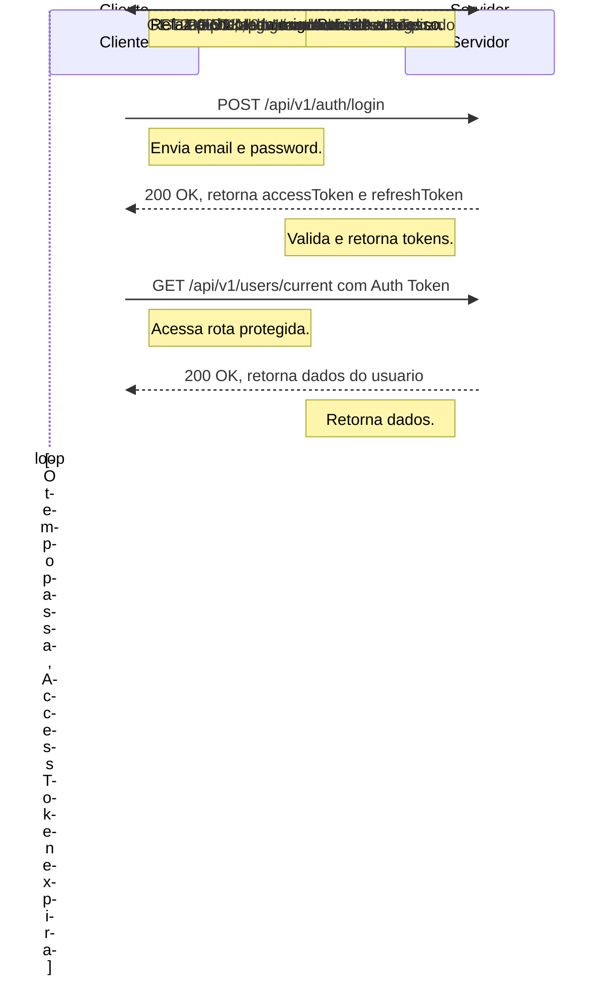

```mermaid
sequenceDiagram
    participant Client as Cliente
    participant Server as Servidor

    Client->>Server: POST /api/v1/auth/login
    Note right of Client: Envia email e password.

    Server-->>Client: 200 OK, retorna accessToken e refreshToken
    Note left of Server: Valida e retorna tokens.

    Client->>Server: GET /api/v1/users/current com Auth Token
    Note right of Client: Acessa rota protegida.

    Server-->>Client: 200 OK, retorna dados do usuario
    Note left of Server: Retorna dados.

    loop O tempo passa, Access Token expira
    end

    Client->>Server: GET /api/v1/blogs com Auth Token expirado
    Note right of Client: Tenta acessar rota.

    Server-->>Client: 401 Unauthorized
    Note left of Server: Rejeita o acesso.

    Client->>Server: POST /api/v1/auth/refresh-token
    Note right of Client: Solicita novo token.

    Server-->>Client: 200 OK, retorna novo accessToken
    Note left of Server: Emite novo Access Token.

    Client->>Server: GET /api/v1/blogs com novo Auth Token
    Note right of Client: Refaz a chamada original.

    Server-->>Client: 200 OK, retorna dados dos blogs
    Note left of Server: Permite o acesso.
```
