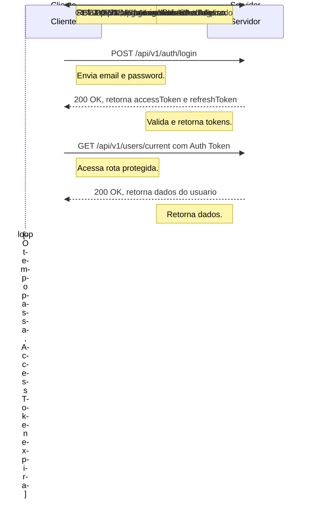

# Blog API

Uma API RESTful para uma plataforma de blog, construída com Node.js, Express, TypeScript e MongoDB. A API fornece um sistema completo para gerenciamento de usuários, posts, comentários e likes, com autenticação baseada em JWT e autorização por papéis.

## Funcionalidades

- **Autenticação e Autorização:** Sistema seguro com JSON Web Tokens (Access & Refresh Tokens) e autorização baseada em papéis (`admin`, `user`).
- **Gerenciamento de Usuários:** CRUD completo para administradores e gerenciamento de perfil para usuários.
- **Gerenciamento de Conteúdo:** Admins podem criar, ler, atualizar e deletar posts no blog.
- **Interação:** Usuários podem comentar e curtir posts.
- **Validação e Segurança:** Validação de entrada de dados, rate limiting para prevenção de abuso e uso de `helmet` para headers de segurança.

## Documentação

A documentação completa da API, incluindo todos os endpoints e modelos de dados, está disponível em GitBook:

[https://fabianolaureano.gitbook.io/blog-api/](https://fabianolaureano.gitbook.io/blog-api/)

## Fluxo de Autenticação

O fluxo mais importante da aplicação é o de autenticação, que garante o acesso seguro aos recursos. O diagrama abaixo ilustra o ciclo de vida do login à renovação do token.

