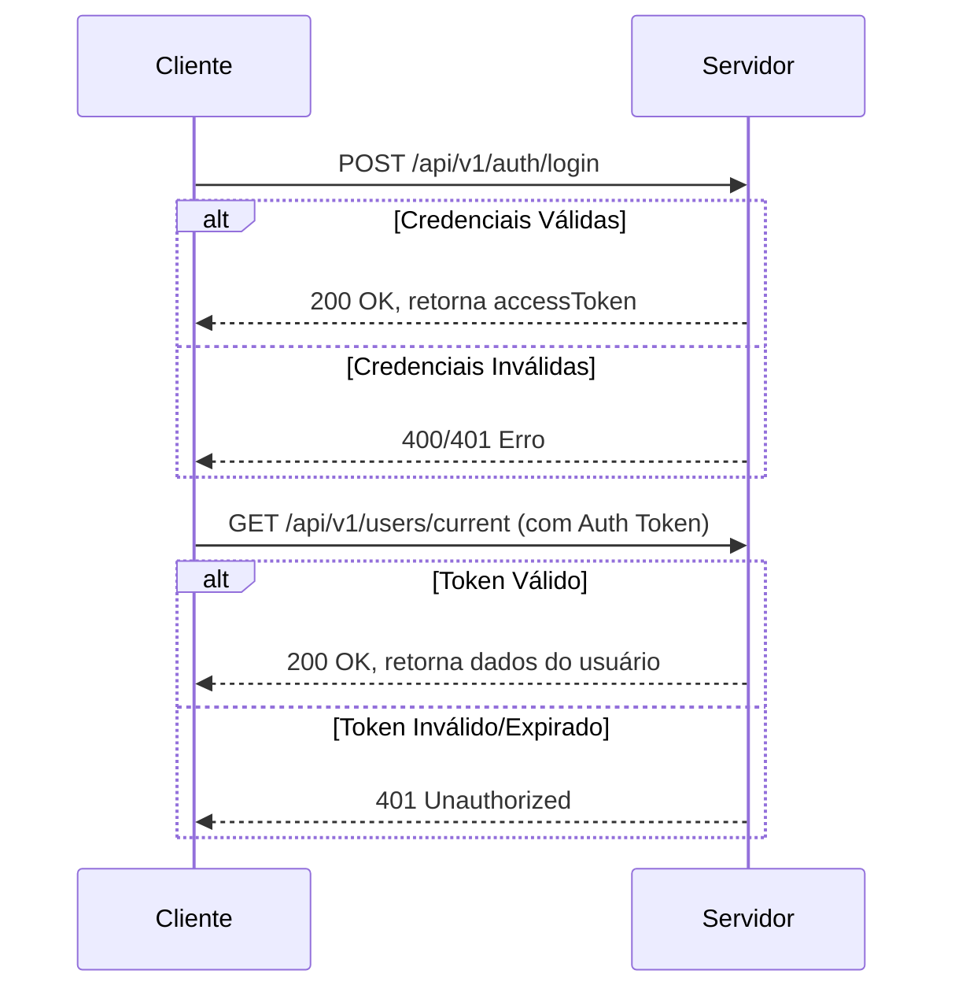

# Blog API

Uma API RESTful para uma plataforma de blog, construída com Node.js, Express, TypeScript e MongoDB. A API fornece um sistema completo para gerenciamento de usuários, posts, comentários e likes, com autenticação baseada em JWT e autorização por papéis.

## Funcionalidades

- **Autenticação e Autorização:** Sistema seguro com JSON Web Tokens (Access & Refresh Tokens) e autorização baseada em papéis (`admin`, `user`).
- **Gerenciamento de Usuários:** CRUD completo para administradores e gerenciamento de perfil para usuários.
- **Gerenciamento de Conteúdo:** Admins podem criar, ler, atualizar e deletar posts no blog.
- **Interação:** Usuários podem comentar e curtir posts.
- **Validação e Segurança:** Validação de entrada de dados, rate limiting para prevenção de abuso e uso de `helmet` para headers de segurança.

## Configuração

Siga os passos abaixo para configurar e executar o projeto localmente.

1.  **Clone o repositório:**
    ```bash
    git clone <URL_DO_REPOSITORIO>
    cd blog-api
    ```

2.  **Instale as dependências:**
    ```bash
    npm install
    ```

3.  **Configure as Variáveis de Ambiente:**
    Crie um arquivo `.env` na raiz do projeto e adicione as seguintes variáveis:

    ```env
    # Configurações do Servidor
    PORT=3000
    NODE_ENV=development

    # CORS (adicione a URL do seu frontend)
    WHITELIST_ORIGINS=http://localhost:5173

    # MongoDB
    DATABASE_URL=mongodb://localhost:27017/blog-api

    # JWT Secrets (use valores longos e aleatórios)
    ACCESS_TOKEN_SECRET=sua_chave_secreta_aqui
    REFRESH_TOKEN_SECRET=sua_outra_chave_secreta_aqui

    # Cloudinary (para upload de imagens)
    CLOUDINARY_CLOUD_NAME=seu_cloud_name
    CLOUDINARY_API_KEY=sua_api_key
    CLOUDINARY_API_SECRET=sua_api_secret
    ```

4.  **Execute a Aplicação:**
    ```bash
    npm run dev
    ```
    A API estará disponível em `http://localhost:3000` (ou na porta que você definiu).

## Documentação

A documentação completa da API, incluindo todos os endpoints e modelos de dados, está disponível em GitBook:

[https://fabianolaureano.gitbook.io/blog-api/](https://fabianolaureano.gitbook.io/blog-api/)

## Fluxo de Autenticação

O fluxo mais importante da aplicação é o de autenticação, que garante o acesso seguro aos recursos. O diagrama abaixo ilustra o ciclo de vida do login à renovação do token.


